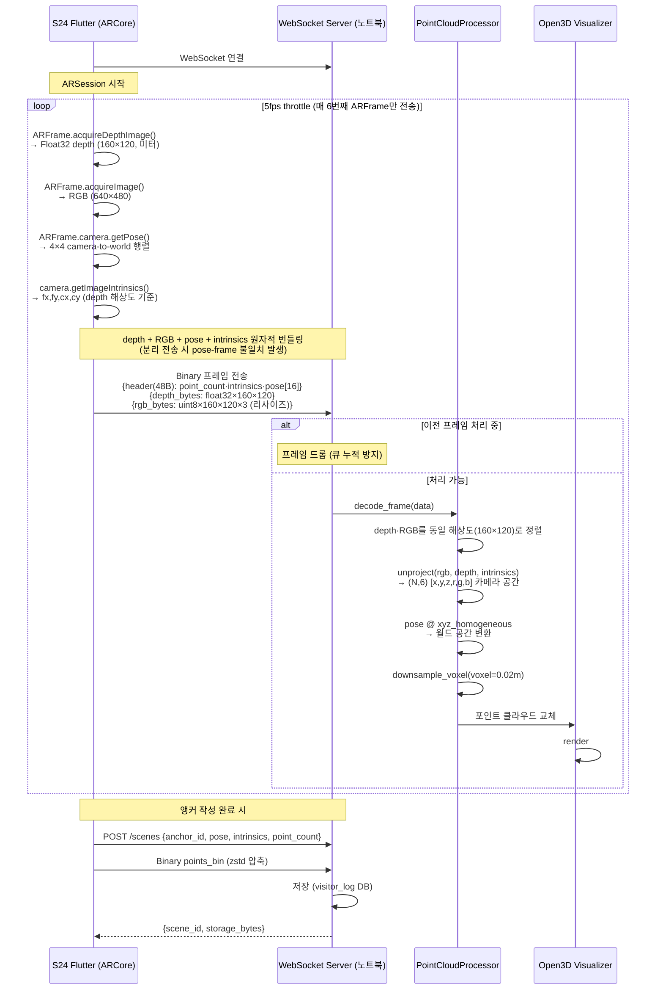
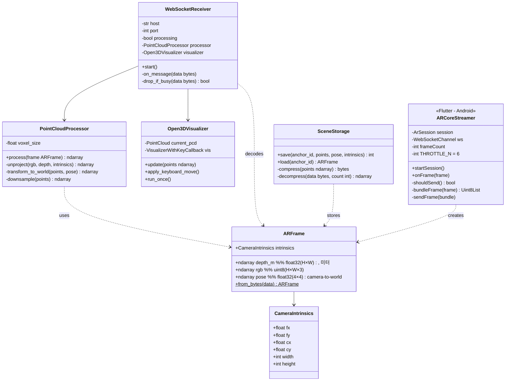

# visitor_log

VPS·AR 앵커 기능의 씬 저장·서빙 서비스.  
Android(ARCore)가 촬영한 depth + RGB + pose를 WebSocket으로 노트북/서버에 스트리밍하고,  
포인트 클라우드로 변환·누적·압축해 나중에 AR 렌더링에 재사용한다.

---

## 아키텍처 개요

```
[S24 Flutter App]  →(WebSocket)→  [노트북/서버 Python]  →(저장)→  [visitor_log API]
  ARCore depth                       unproject                        zstd 압축 저장
  ARCore RGB                         pose 변환                        앵커별 씬 관리
  ARCore Pose                        누적 + 다운샘플
  Camera Intrinsics                  Open3D 시각화
```

---

## 시퀀스 다이어그램



---

## 클래스 다이어그램



---

## 비판적 설계 결정

| 결정 | 이유 |
|------|------|
| 5fps throttle (매 6번째 프레임) | 30fps × 75KB/frame = 2.25MB/s 초과. WiFi 안정성 고려 5fps(~375KB/s)로 제한 |
| depth + RGB를 동일 해상도(160×120)로 정렬 | ARCore depth(160×120) ≠ RGB(640×480). 역투영 전 RGB를 depth 크기로 리사이즈 후 전송 |
| Pose + frame 원자적 번들링 | 분리 전송 시 네트워크 지연으로 pose-frame 불일치 → 포인트 위치 오류 |
| 처리 중 신규 프레임 드롭 | 큐 누적 시 메모리 폭발 + 지연 누적. 최신 프레임만 처리 |
| 카메라 공간 → 월드 공간 변환 | ARCore Pose가 절대 world 좌표계 제공 → DEPTH_SCALE 불필요, 누적 오차 없음 |

---

## 실행 방법

### spike (노트북 웹캠, ARCore 없이 파이프라인 구조 검증)

```bash
cd visitor_log
py -3.12 -m venv .venv
.venv\Scripts\activate
pip install -r spike/requirements_poc.txt opencv-python open3d keyboard
python spike/realtime.py
```

### 서비스 전환 (예정)

1. S24 Flutter ARCore 앱 → WebSocket 스트리밍
2. `python server.py` (WebSocket 수신 + 포인트 클라우드 처리)
3. `visitor_log` FastAPI 서버 → 씬 저장·서빙

---

## 현재 상태

| 컴포넌트 | 상태 |
|---------|------|
| spike/realtime.py (웹캠) | ✅ 작동 — 구조 검증 완료 |
| ARCoreStreamer (Flutter) | ⏳ 미구현 |
| WebSocketReceiver | ⏳ 미구현 |
| SceneStorage (FastAPI) | ⏳ 미구현 |
